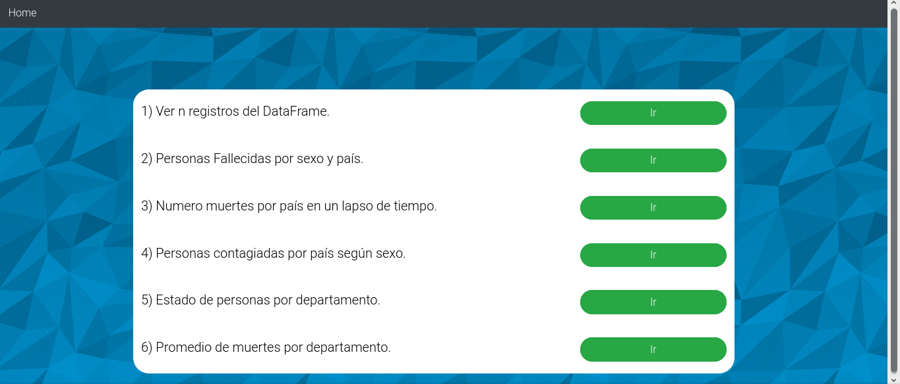
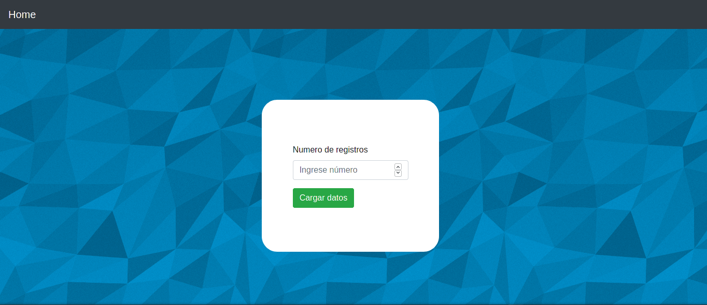
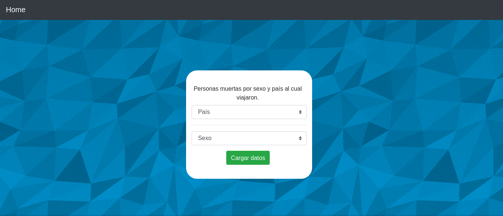
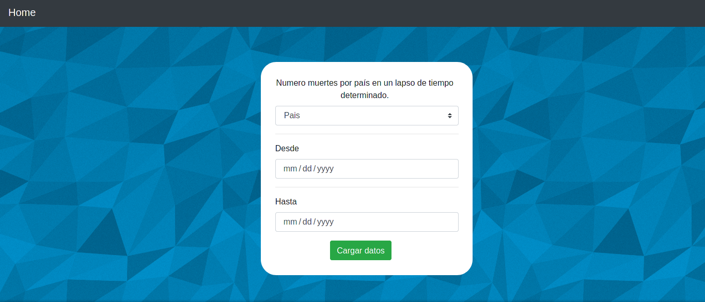
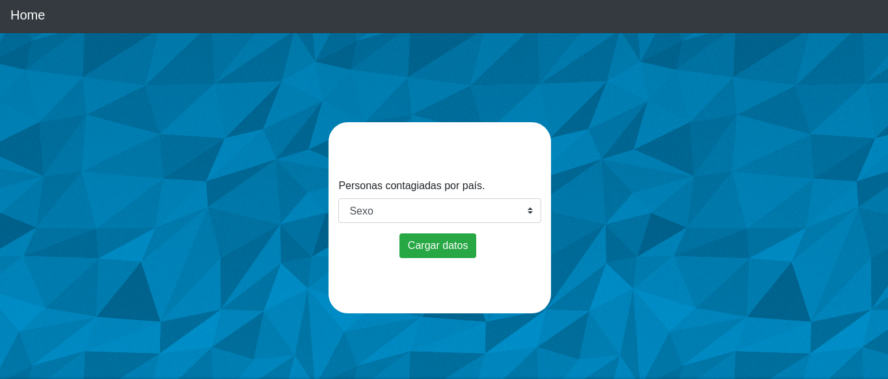
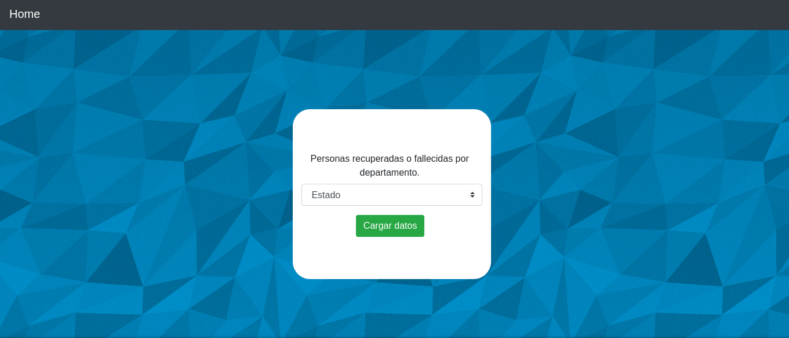

# view app data

Esta es una aplicacion web para realizar consultas prediseñadas con parámetros definidos por el usuario en un DataFrame de casos positivos de COVID-19.

## Autores

- Sergio David Paez Suarez 20191020167
- Miguel Ángel Rico García 20191020107
- Estefany Murillo Torres 20191020123

## Instalacion dependencias

Para ejecutar la aplicacion debe instalar con el gestor de paquetes pip las dependencias especificadas en el archivo `requirements.txt`

```
python -m pip install -r requirements.txt
```
## Ejecucion 
Una vez se encuentre parado en la carpeta `src ` del proyecto ejecute el comando 

```
python App.py
```

luego dirijase a `http://localhost:3000/` para ver la aplicacion

## Vistas

- inicio


- formulario 1


- formulario 2


- formulario 3


- formulario 4


- formulario 5
